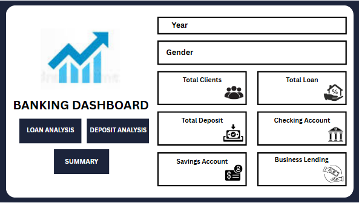
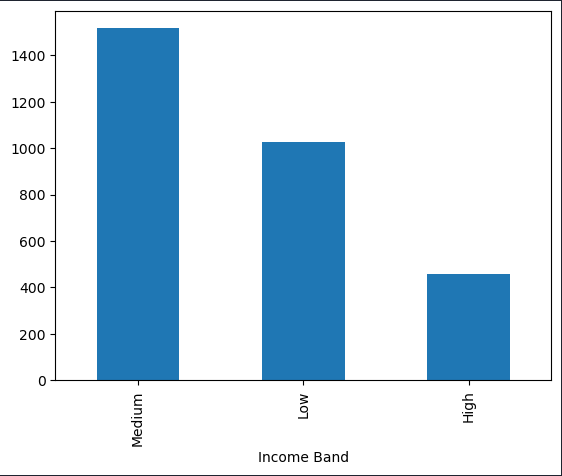
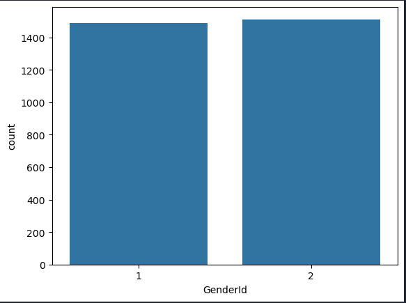
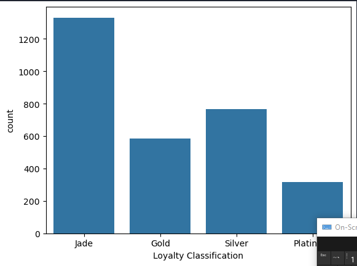
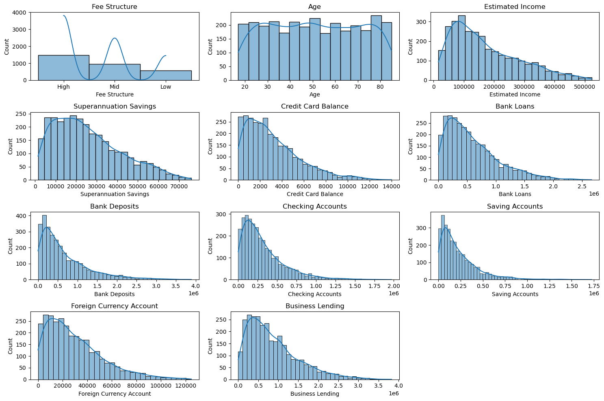

# Banking Data Analysis and Dashboard



This Power BI project delivers an interactive dashboard to analyze banking metrics, including Loan, Deposits, customer segmentation, and revenue trends. Designed to support data-driven decision-making, it provides actionable insights for bank managers, analysts, and stakeholders through dynamic visualizations.

The dataset is sourced from Kaggle and provides a foundation for my analysis, containing detailed information on Client Id and Name, Nationality, Bank Loan, Bank Deposit, Saving and Checking Accounts etc. Through a Jupiter Notebook Script, I explore Deposit and Saving Behavior, Personal and Business Banking as well as the correlation between Income, Age, Properties Owned and Accumulation.

# Tools I Used

For my deep dive into the data analyst job market, I harnessed the power of several key tools:

- **MySQL** Loaded the csv dataset into MySQL Database for storage and easy access.
- **Python:** The backbone of my analysis, allowing me to analyze the data and find critical insights.I also used the following Python libraries:
  - **Pandas Library:** This was used to analyze the data.
  - **Matplotlib Library:** I visualized the data.
  - **Seaborn Library:** Helped me create more advanced visuals.
- **Jupyter Notebooks:** The tool I used to run my Python scripts which let me easily include my notes and analysis.
- **Visual Studio Code:** My go-to for executing my Python scripts.
- **PowerrBI:** Created an interactive Dashboard summerizing my insights and displaying key Performance Indicators.
- **Git & GitHub:** Essential for version control and sharing my Python code and analysis, ensuring collaboration and project tracking.

# Data Preparation and Cleanup

This section outlines the steps taken to prepare the data for analysis, ensuring accuracy and usability.

## Import & Clean Up Data

I start by importing necessary libraries and loading the dataset, followed by initial data cleaning tasks to ensure data quality.

```python
# Import Libraries
import mysql.connector
import pandas as pd
import matplotlib.pyplot as plt
import seaborn as sns

# connect to database and extract data
conn = mysql.connector.connect(
    host='localhost',
    port=3306,
    user='root',
    password='root',
    database='banking_case'
)
query = 'SELECT * FROM customer'
df = pd.read_sql(query, conn)
conn.close() # close the connection

# Data Cleanup
# change the data type to appropriate type
df['Joined Bank'] = pd.to_datetime(df['Joined Bank'], format='%d-%m-%Y')
print(df['Joined Bank'].dtype)
```

# Exploratory Data Analysis

### Categorical Data

Conduct Univariate Analysis of Categorical columns

1. Investigate the Income Bands of clients by analyzinng `Estimated Income` column

```python
# set the bounderies for Income Bands
bin = [0, 100000, 300000, float('inf')]
labels=['Low', 'Medium', 'High']

df['Income Band'] = pd.cut(df['Estimated Income'], bins=bin, labels=labels, right=False)
df['Income Band'].value_counts().plot(kind='bar')
```



2. Distribution of other noteworthy categorical columns

```python
# display count of each category
for i, col in enumerate(categorical_cols):
    plt.figure(i)
    sns.countplot(data=df, x=df[col])
```

a. There is almost parity between the number of Male(1) and Female(2) Clients.



b. The Majority of Clients are of European Nationality Followed by Asians in a distant Second.


c. Most clients have a Loyalty Classification of Jade.



### Numerical Analysis

Numerical analysis and exploration

```python
numerical_cols = ['Fee Structure','Age', 'Estimated Income', 'Superannuation Savings', 'Credit Card Balance', 'Bank Loans', 'Bank Deposits', 'Checking Accounts', 'Saving Accounts', 'Foreign Currency Account', 'Business Lending']
```

Univariate analysis and visualization

```python
plt.figure(figsize=(15, 10))
for i, col in enumerate(numerical_cols):
    plt.subplot(4, 3, i + 1)
    sns.histplot(df[col], kde=True)
    plt.title(col)
plt.tight_layout()
plt.show()
```



### Bivariate Analysis

Select numerical columns for correlation analysis

```python
numerical_cols = ['Age', 'Estimated Income', 'Superannuation Savings', 'Credit Card Balance',
                  'Bank Loans', 'Bank Deposits', 'Checking Accounts', 'Saving Accounts',
                  'Foreign Currency Account', 'Business Lending', 'Properties Owned']

# Calculate the correlation matrix
correlation_matrix = df[numerical_cols].corr()

# Create a heatmap of the correlation matrix
plt.figure(figsize=(12, 10))
sns.heatmap(correlation_matrix, annot=True, cmap='crest', fmt=".2f")
plt.title('Correlation Matrix of Numerical Features')
plt.show()
```

## Insights

### Deposits and Savings Behavior

The high correlation between Bank Deposits and Saving Accounts suggests that these may either measure overlapping financial behavior (e.g., total funds a customer keeps in the bank) or that people who actively deposit funds also tend to maintain or grow savings balances.

### Income, Age, and Accumulation

Moderate correlations of Age and Estimated Income with various balances (Superannuation, Savings, Checking) reflect a common financial lifecycle trend: higher income earners and older individuals often accumulate more savings, retirement funds, and may carry higher credit card balances or loans.

### Low Correlation with Properties Owned

Property ownership may depend on external factors (location, real estate market conditions, inheritance, etc.) that are not captured by these particular banking variables. Hence, we see weaker correlations here.

### Business vs. Personal Banking

Business Lending’s moderate link to Bank Loans suggests some customers may have both personal and business debts. However, business lending is relatively uncorrelated with other deposit or property-related metrics, indicating it may serve a distinct subset of customers or needs.
